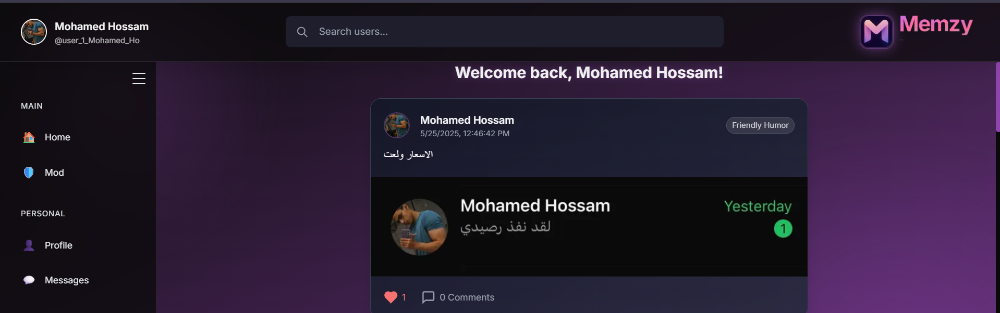

# 😂 Memzy: Your Personalized Humor Hub

<p align="center">
  <a href="#"> 
  </a>
</p>

<div align="center">

[](https://opensource.org/licenses/MIT) [](https://nextjs.org/) [](https://dotnet.microsoft.com/) [](https://tailwindcss.com/) [](https://www.microsoft.com/en-us/sql-server/)

</div>

Memzy is a vibrant, full-stack web application designed for meme enthusiasts who crave a fun, customizable, and engaging sharing experience. Built with the powerful combination of **Next.js** for a blazing-fast frontend and **.NET Core** for a robust backend, Memzy empowers users to personalize their humor preferences, manage their profiles, and connect with a modern social platform that boasts real-time features and a truly responsive UI.

Get ready to dive into a world of laughter tailored just for you!

---

## 📚 Table of Contents

- ✨ [Key Features](#-key-features)
- 🚀 [Live Demo & Screenshots](#-live-demo--screenshots)
- 🧰 [Tech Stack](#-tech-stack)
- 🎬 [Getting Started](#-getting-started)
  - 📦 [Backend Setup](#-backend-setup)
  - 💻 [Frontend Setup](#-frontend-setup)
- 🔐 [Environment Variables](#-environment-variables)
- 📁 [Project Structure](#-project-structure)
- 📡 [API Endpoints](#-api-endpoints)
- 🤝 [Contributing](#-contributing)
- 📝 [License](#-license)

---

## ✨ Key Features

Memzy offers a rich set of features designed to enhance your meme-sharing journey:

- 🔒 **Secure Authentication**: Robust JWT-based authentication for seamless user login and registration.
- 🧑‍🎨 **Personalized Profiles**: Customize your presence with editable names, bios, and profile pictures.
- 😂 **Tailored Humor Preferences**: Fine-tune your content feed by selecting humor types (e.g., Dark, Friendly) to see more of what you love.
- 🔄 **Effortless Password Management**: Secure and straightforward options for updating your password.
- 💬 **Real-time Engagement**: Experience dynamic interactions with real-time messaging powered by WebSockets, bringing conversations to life.
- 📱 **Adaptive & Responsive UI**: Enjoy a consistent and beautiful experience across all devices, thanks to a mobile-first design implemented with Tailwind CSS.
- ⚙️ **Clean RESTful API**: A meticulously designed, modular, and scalable backend architecture following REST principles.
- 📐 **SOLID Principles**: Adherence to SOLID principles ensures a maintainable, extensible, and robust codebase.

---

## 🚀 Live Demo & Screenshots

*(If you have a live demo, link it here!)*
Check out Memzy in action: `[Link to your live demo (if available)]` *(Add screenshots here to showcase your application's UI. This is highly recommended!)*


*A captivating screenshot of the Memzy home feed.*


*Another screenshot showing profile customization.*

---

## 🧰 Tech Stack

Memzy is built with a modern and powerful tech stack to ensure performance, scalability, and an excellent developer experience.

### Frontend

- **[Next.js](https://nextjs.org/)**: A React framework for production, providing server-side rendering and static site generation.
- **[React](https://react.dev/)**: A declarative, efficient, and flexible JavaScript library for building user interfaces.
- **[Tailwind CSS](https://tailwindcss.com/)**: A utility-first CSS framework for rapidly building custom designs.
- **[Headless UI](https://headlessui.dev/)**: Completely unstyled, fully accessible UI components, designed to integrate beautifully with Tailwind CSS.

### Backend

- **[.NET Core Web API](https://dotnet.microsoft.com/)**: A cross-platform, high-performance framework for building modern, cloud-based, internet-connected applications.
- **[Entity Framework Core](https://learn.microsoft.com/en-us/ef/core/)**: A modern object-database mapper for .NET, enabling developers to work with a database using .NET objects.
- **SQL Server**: The default relational database management system, though easily configurable for other RDBMS (e.g., PostgreSQL, MySQL).

---

## 🎬 Getting Started

Follow these instructions to set up and run Memzy on your local machine.

### 📦 ### Backend Setup

1. **Clone the repository:**
   ```sh
   git clone https://github.com/yourusername/memzy_finalist.git
   cd memzy_finalist/backend
   ```

2. **Configure your database:**
   - Update `appsettings.json` with your SQL Server connection string.

3. **Run migrations:**
   ```sh
   dotnet ef database update
   ```

4. **Start the backend server:**
   ```sh
   dotnet run
   ```
   The API will be available at `https://localhost:5001` (or as configured).

---

### 💻 ### Frontend Setup

1. **Navigate to the frontend directory:**
   ```sh
   cd ../frontend
   ```

2. **Install dependencies:**
   ```sh
   npm install
   ```

3. **Set up environment variables:**  
   Create a `.env.local` file and add:
   ```
   NEXT_PUBLIC_BACKEND_API_URL=https://localhost:5001
   ```

4. **Run the development server:**
   ```sh
   npm run dev
   ```
   The app will be available at `http://localhost:3000`.

---

## Environment Variables

**Frontend:**
- `NEXT_PUBLIC_BACKEND_API_URL` – URL of your backend API

**Backend:**
- `ConnectionStrings:DefaultConnection` – SQL Server connection string
- JWT secret keys, etc. (see `appsettings.json`)

---

## 📁 Project Structure

Memzy follows a clear and organized project structure, separating the backend and frontend into distinct directories to promote modularity and ease of development.

---

## Project Structure

```
memzy_finalist/
│
├── backend/         # .NET Core Web API
│   ├── Controllers/
│   ├── Models/
│   ├── Data/
│   └── ...
│
└── frontend/        # Next.js app
    ├── pages/
    ├── components/
    ├── Context/
    └── ...
```

---

## 📡 ---

## API Endpoints

**Auth**
- `POST /api/Auth/login` – User login
- `POST /api/Auth/register` – User registration
- `GET /api/Auth/getCurrentUser` – Get current user info

**User**
- `POST /api/User/UpdateUsername`
- `POST /api/User/UpdateUserBio`
- `POST /api/User/UpdateProfilePicture`
- `POST /api/User/change-password`

**Humor**
- `PUT /api/Humor/ChangeHumor`

*(See backend controllers for full details.)*

---

## Contributing

Pull requests are welcome! For major changes, please open an issue first to discuss what you would like to change.

---

## 📝 License

This project is licensed under the MIT License - see the [LICENSE](LICENSE) file for details.

---

**Made with ❤️ by Memzy Team**